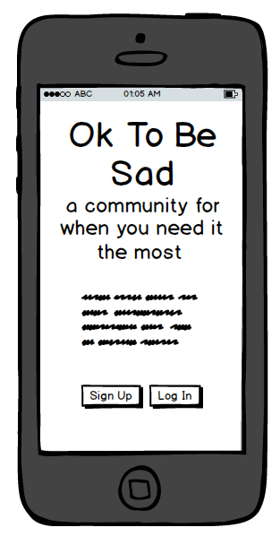
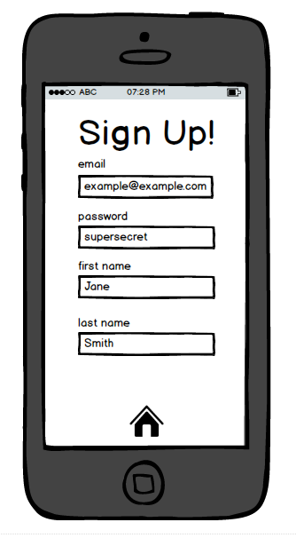
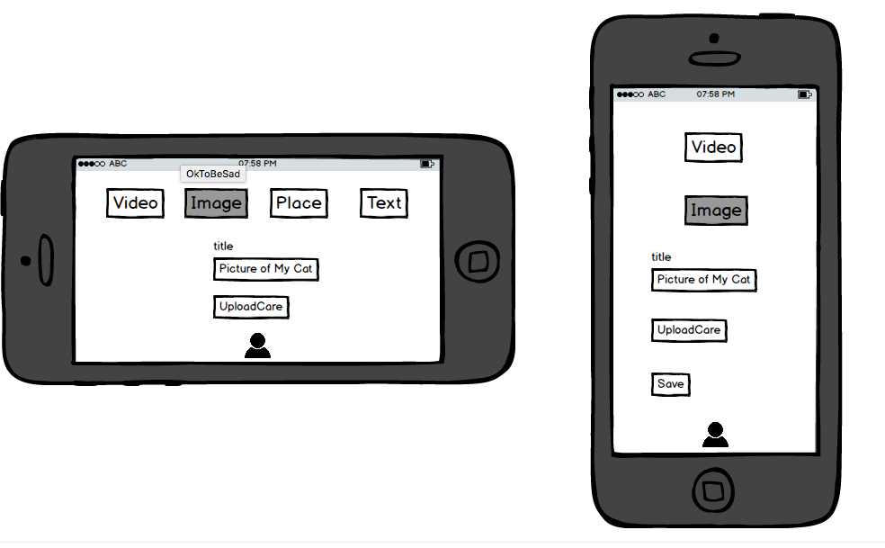
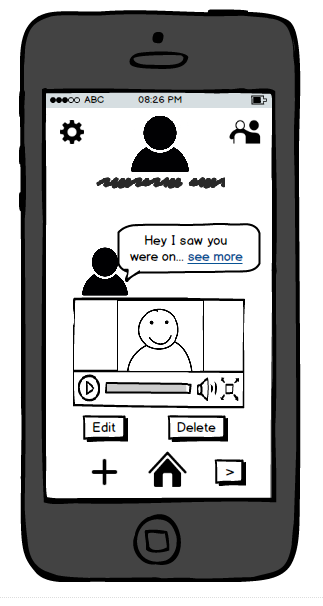

# [Ok To Be Sad] (http://oktobesad.herokuapp.com)

*Do you have a favorite song or YouTube video that always seems to cheer you up? Ok To Be Sad makes your favorite media immediately accessible from your phone when you need it the most. Once in  *

### ERD
Entity Relationship Diagram:


### Wireframes
Landing Page When Logged In:


Splash Page When Not Logged In:


Sign Up:


Article Forms:


User Profile:



### Technologies
+ Ruby on Rails
+ Javascript / jQuery
+ WebSocket Implementation of Faye Instant Messaging
+ Thin Rails Server
+ Swipe Mobile Gestures Through Owl jQuery Library
+ Livestamp jQuery Library for Timestamp Live Updates
+ UploadCare Media Uploading

### Installation Steps

+ Clone this repository using this command in your terminal (you may want to fork and then clone if you wish to contribute):
```
git clone https://github.com/billhimmelsbach/ok-to-be-sad.git
```

+ Navigate into the directory you cloned the repository to using your terminal:
```
cd ok-to-be-sad
```

+ Install the required gems using bundle install in your terminal:
```
bundle install
```

+ Create the PostgreSQL database using rake db:create in your terminal:
```
rake db:create
```

+ Run all of the necessary migrations by using rake db:migrate in your terminal:
```
rake db:migrate
```

+ Start the Rails server using your terminal:
```
rails s
```
Start the server by typing rails server in the terminal
Open your browser and input localhost:3000 or whatever is displayed in your terminal after running the server


### Planned Features
+ Support for a wider array of devices using more granular orientation and width media queries
+ Vastly increase testing coverage and fully implement factory_girl
+ Allow friendships between users using a self-referential friendship table
+ Users can message their friends exclusively through Faye, messaging suggestions are displayed on the article index
+ Friends can share their favorite articles with their friends
+ Article indexes are automatically populated with friends' articles
+ Assist in new user creation by allowing them to choose from a list of popular articles to pre-seed their article list
+ Refreshing the article index with only articles that have not been seen recently though the use of a "last_seen" addition to the articles table
+ Once friendships and sharing have been enabled, enable FriendlyId for articles and users  
+ Implement infinite scroll on the user show page, displaying them in groups of 10
+ Create an admin account that can delete messages from the general chat. Consider also putting on a cap on messages per time period.
+ Allow user to search for YouTube videos though the YT gem and Spotify songs through the Spotify API in a more user friendly way,
+ Add social sharing gem for sharing of articles on Facebook and Twitter
+ Consider switching to a polling method for messaging for better server scalability
+ Long Term Goal: Replace Owl/Livestamp with the React framework
